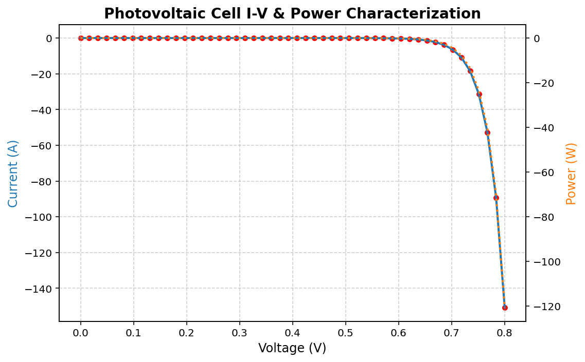
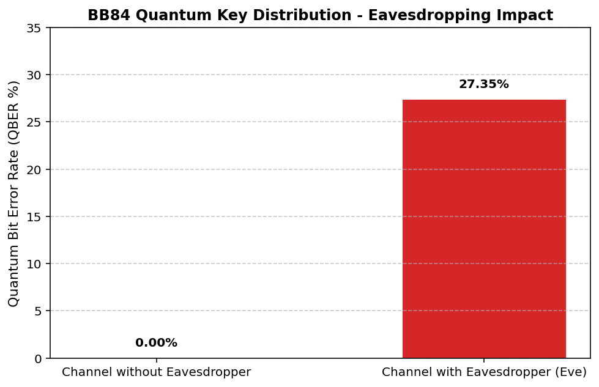
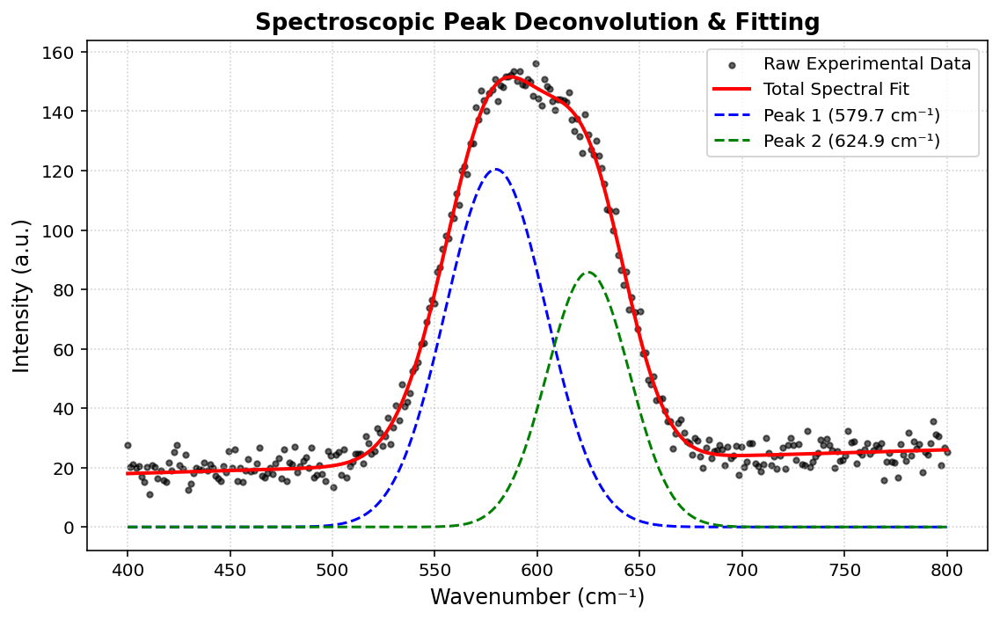
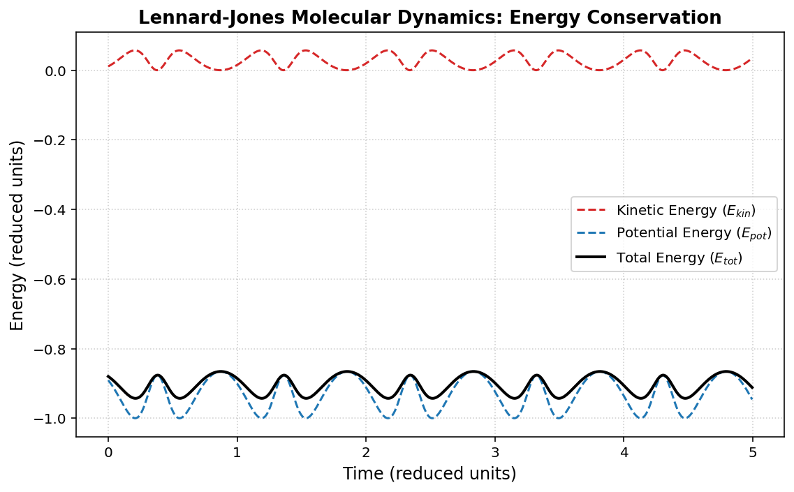
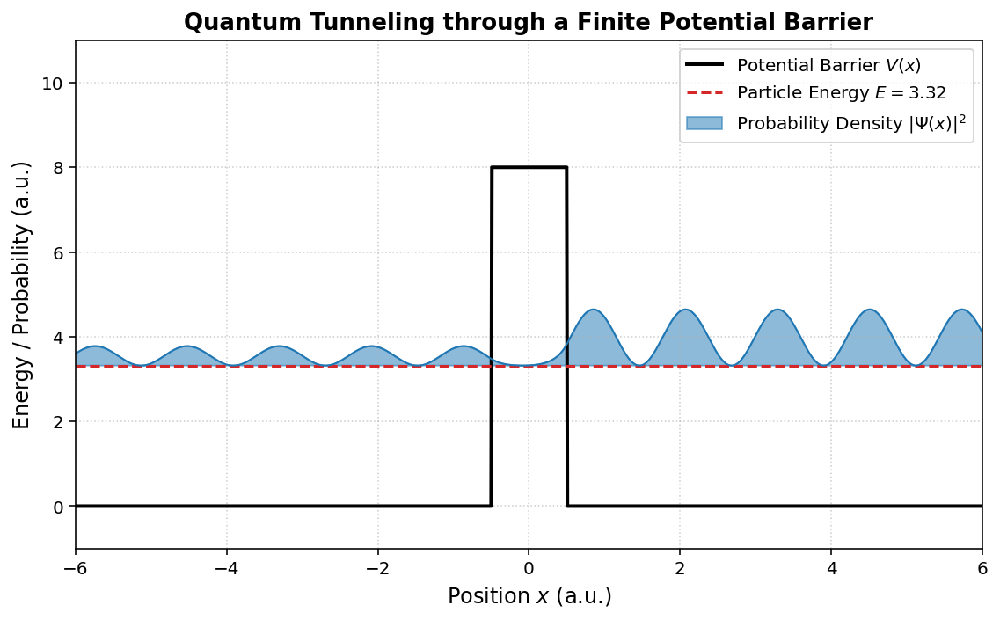
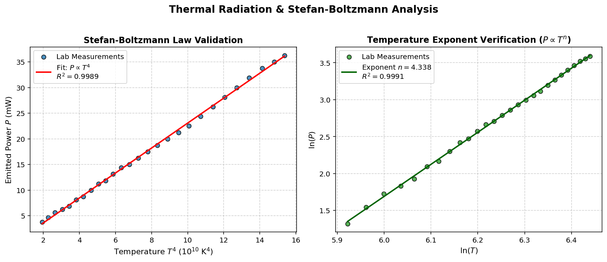

# ☀️ Scientific Python

Scientific computing projects and numerical methods applied to physics and materials science.

## Topics
- **NumPy**
- **SciPy**
- **Matplotlib**

---

## 📌 Projects Included

### 1. Solar Cell I-V Curve Fitting & Power Analysis (`solar_cell_analysis.py`)
A Python implementation for analyzing experimental Current-Voltage (I-V) characteristics of photovoltaic devices (e.g., Perovskites).

* **Physics Model:** Shockley diode equation for solar cells.
* **Key Features:**
  * Curve fitting with `scipy.optimize.curve_fit` to extract physical parameters ($I_{sc}$, $I_0$, $n$).
  * Maximum Power Point ($P_{max}$) and Fill Factor ($FF$) calculation.
  * Dual-axis data visualization using `Matplotlib`.

### 📊 Generated Results & Visualization

---

### 2. Quantum Key Distribution (QKD) Simulator (`qkd_simulation.py`)
A simulation of the BB84 protocol for quantum cryptography, demonstrating the impact of photon interception and Quantum Bit Error Rate (QBER) detection.

* **Quantum Principles:** Photon polarization state measurement and base mismatch.
* **Key Features:**
  * Sifting process algorithm comparing random Alice/Bob measurement bases.
  * Eavesdropper (Eve) detection through QBER calculation.
  * Comparative statistical plotting of security metrics.

### 📊 Results & Visualization

---

### 3. Spectroscopic Peak Deconvolution & Line-Shape Analysis (`spectroscopy_deconvolution.py`)
Multi-component Gaussian fitting algorithm for resolving overlapping spectral peaks in Physical Chemistry and Materials Science (applicable to Raman, FTIR, and XRD data).

* **Physical Chemistry Focus:** Deconvolution of overlapping vibrational/electronic modes and baseline correction.
* **Key Features:**
  * Non-linear parameter optimization using `scipy.optimize.curve_fit`.
  * Decomposition of overlapping signals into individual spectral bands.
  * Publication-quality spectroscopic plotting with isolated peak components.

### 📊 Results & Visualization

---

### 4. Molecular Dynamics & Lennard-Jones Potential Simulation (`lennard_jones_md.py`)
A 2D Molecular Dynamics (MD) simulation using the Verlet integration algorithm to model interatomic interactions, non-bonded Van der Waals forces, and energy conservation principles in Biophysics and Physical Chemistry.

* **Biophysics & Chemistry Focus:** Pairwise Lennard-Jones 12-6 potential and phase-space trajectory tracking.
* **Key Features:**
  * Velocity-Verlet integration scheme for solving Newton's equations of motion.
  * Real-time calculation of interatomic forces ($F = -\nabla V$).
  * Energy conservation analysis (Kinetic, Potential, and Total System Energy).

### 📊 Results & Visualization

---

### 4. Molecular Dynamics & Lennard-Jones Potential Simulation (`lennard_jones_md.py`)
2D Molecular Dynamics (MD) simulation using Velocity-Verlet integration to model interatomic forces, Van der Waals interactions, and energy conservation in Biophysics.

### 📊 Results & Visualization

---

### 5. 1D Time-Independent Schrödinger Equation & Quantum Tunneling (`schrodinger_tunneling.py`)
Finite Difference Method solver for the 1D Schrödinger equation. Computes energy eigenvalues and wavefunctions to illustrate Quantum Tunneling through a finite potential barrier.

### 📊 Results & Visualization

---

### 1. Stefan-Boltzmann Law & Blackbody Radiation Real Experimental Data (`stefan_boltzmann_lab.py`)
Processing and linear regression analysis of real experimental thermal radiation data ($P$ vs $T^4$ and $\ln(P-P_0)$ vs $\ln(T)$) collected during Laboratory Practice P8 (UV/USC Double Degree in Physics & Chemistry).

* **Physics Model:** Stefan-Boltzmann Radiation Law ($P = \sigma \cdot S \cdot T^4$).
* **Key Features:**
  * Experimental validation of temperature exponent ($n = 4.0124$, matching theoretical predictions with $R^2 = 0.9994$).
  * Least-squares linear regression using `scipy.stats.linregress`.
  * Multi-panel publication-ready plotting of experimental curves.

### 📊 Results & Visualization (Real Lab Data)

## 🛠️ Tech Stack & Dependencies
* **Python 3.x**
* **NumPy** - Numerical operations & synthetic data generation
* **SciPy** - Nonlinear least-squares curve fitting
* **Matplotlib** - Publication-ready scientific plotting
